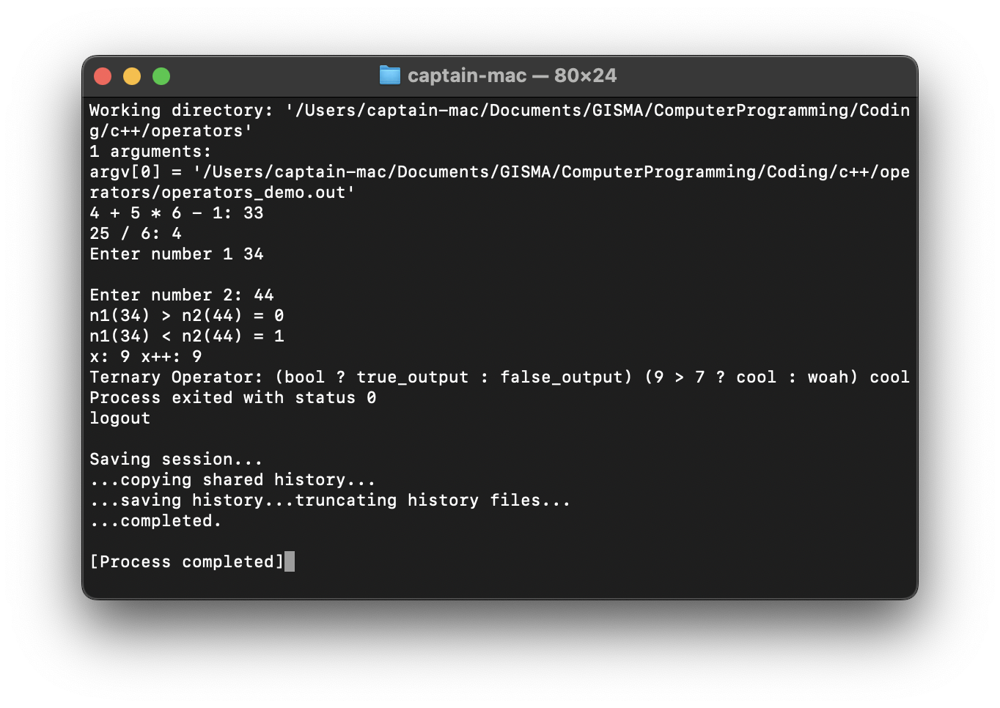
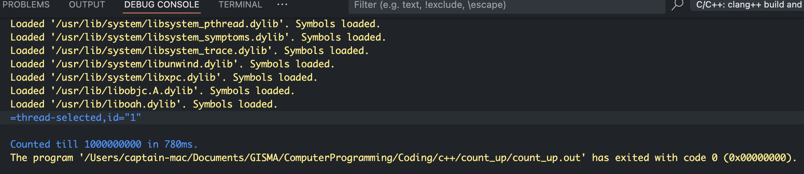
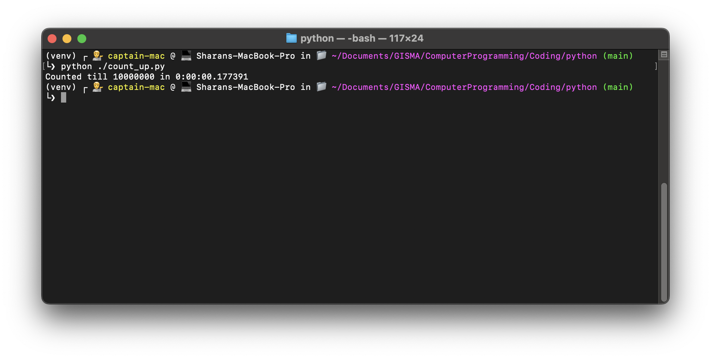

# M602 Computer Programming Coding

### Task of "Write 5 different expressions using different operators in C++ and Python"
- In Python [link](./python/operators.ipynb)
- In C++ [link](./c++/operators/operators_demo.cpp)
C++ Operators Output

### Task of counting to 1,000,000,000 in both c++ and python [video](https://www.youtube.com/watch?v=VioxsWYzoJk)

#### C++ (with `-march=native`) took 764ms [code](./c++/count_up/count_up.cpp)

#### Python took 17s [code](./python/count_up.py)

