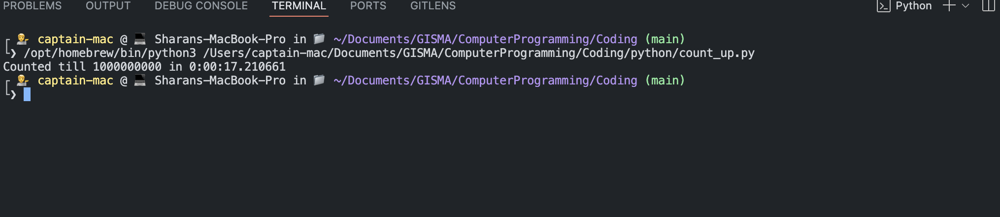

# M602 Computer Programming Coding

### Task of counting to 1,00,00,000 in both c++ and python

### Update:

#### C++ with flag of `-march=native` took 7ms [flag in `tasks.json`](.vscode/tasks.json)

#### C++ took 22ms [code](./c++/count_up/count_up.cpp)

#### Python took 17ms [code](./python/count_up.py)

